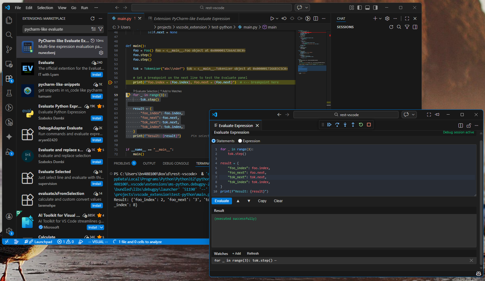

[](LICENSE)

# PyCharm-like Evaluate Expression

A VS Code / Cursor extension that provides a **multi-line Evaluate Expression panel** for debugging, inspired by PyCharm's Evaluate Expression dialog.

## What's New in 1.6.0 🎉

- **Step controls in the panel** — Continue/Pause, Step Over, Step Into, and Step Out buttons live next to the mode toggle. Detach the panel into a floating window and it becomes a full **debugging HUD**: evaluate, inspect the result tree, step, watch everything refresh — without ever touching the main window. Buttons enable and disable with the debugger's run state, and the panel's editor group is locked so stepped-into files open beside your code, not beside the panel.

## Previously in 1.5.x

- **Structured result tree** — results with structure (dicts, lists, objects) render as an **expandable tree**: click to drill into nested data, PyCharm style, with lazy loading and paging for large collections. Finally, a big place to explore objects instead of the cramped Variables sidebar.
- **Program output in the Result panel** *(since 1.4.2)* — `print()` and stderr from your evaluated code appear right above the result, in every console mode. No more keeping the Debug Console open alongside.
- **Crash-proof diagnostics** — logs persist across window reloads; one command copies a full diagnostic report for bug filing.
- Plus: the `RuntimeWarning` noise from auto-refresh is silenced, and Expression mode gained the full evaluation engine.

*(Coming from 1.3.0? See the changelog below — 1.4.0 fixed the two big ones: new variables persist in the paused frame, and the Variables panel auto-refreshes.)*

## Why This Extension?

VS Code's Debug Console only supports single-line expressions. If you're coming from PyCharm, you know how powerful it is to evaluate multi-line code blocks — loops, conditionals, function calls — all at once while paused at a breakpoint. This extension brings that workflow to VS Code and Cursor.

## Screenshot

Paused at a breakpoint, evaluating `tok`: the object expands into its attributes in the **result tree**, the **step controls** sit in the panel header, and the panel's editor group is **locked** (lock icon) so stepped-into files open beside your code. New variables you create persist in the paused frame and appear in the Variables panel immediately.



> **Tip:** For a PyCharm-style floating dialog, detach the panel into its own window — see [Floating Window](#tip-floating-window).


## Features

- **Multi-line evaluation in the paused frame** — run loops, conditionals, and whole blocks at a breakpoint; new variables and mutations persist and appear in the Variables panel
- **Variables, Watches, and Call Stack auto-refresh** after each evaluation (configurable via `evaluate.autoRefreshVariables`)
- **Debug-toolbar button** — one-click access next to the step controls
- **Syntax-highlighted editor** — CodeMirror 6 with Python/JavaScript highlighting, line numbers, auto-indent, bracket matching, and smart paste (auto-dedent)
- **Statements & Expression modes** — with automatic switching for multi-line code
- **Resizable panes** — drag the divider between the code editor and Result (double-click to reset; size is remembered)
- **Clean error output** — your exception and your frames, without debugger internals (full traceback in the debug log)
- **Multi-language support** — Python (debugpy), JavaScript/TypeScript (Node.js, Chrome), and generic DAP debuggers
- **CodeLens & context menu** — "Evaluate Selection" and "Add to Watches" on selected code during debugging
- **Watches** — expression list that refreshes when the debugger stops and after evaluations
- **History** — navigate previous evaluations with Alt+Up/Down
- **Persistent preferences** — remembers mode, code, and layout between sessions
- **Debug logging** — built-in diagnostic log for easy bug reporting

## Usage

1. Start a debug session and pause at a breakpoint
2. Open the Evaluate panel: click the **calculator button** in the debug toolbar (or `Ctrl+Alt+E`, or Command Palette → "Evaluate: Open Panel")
3. Type multi-line code in the editor
4. Click **Evaluate** (or press `Ctrl+Enter`)
5. See the result in the output area

### Tip: Floating Window (the debugging HUD)

For the best experience, detach the Evaluate panel into its own window:

1. Right-click the **"Evaluate Expression"** tab
2. Select **"Move into New Window"**

This mimics PyCharm's floating Evaluate dialog and lets you keep your code fully visible while evaluating expressions. With the step controls in the panel (1.6.0) it becomes a full debugging HUD: evaluate, expand results, step, repeat — without touching the main window.

Two settings make it seamless — **recommended**:

- **Pin the floating window on top.** Click the **pin icon** in the floating window's title bar (or run *"Toggle Always On Top"* from the Command Palette while it's focused). The HUD then stays above the main window no matter what, with no focus flicker when stepping.
- **Stop the main window from grabbing focus on breaks.** Set `debug.focusWindowOnBreak` to `false` in VS Code settings. Stepping and breakpoints then update the editor quietly behind your HUD instead of surfacing the main window.

Position the HUD on a second monitor or over an unused corner of your code, and you have the workflow PyCharm's dialog never quite offered.

### Keybindings

| Shortcut | Fallback | Action |
|----------|----------|--------|
| `Ctrl+Alt+E` | `Ctrl+Shift+F8` | Open the Evaluate panel |
| `Ctrl+Alt+Enter` | `Ctrl+Shift+F9` | Evaluate selected text from the editor |
| `Ctrl+Enter` | — | Evaluate (when focused in the panel's textarea) |
| `Alt+Up` / `Alt+Down` | — | Navigate evaluation history |

> **Note:** If `Ctrl+Alt+E` doesn't work in your environment (e.g., Remote-SSH sessions), use the fallback `Ctrl+Shift+F8` or open via Command Palette → "Evaluate: Open Panel". You can also customize keybindings in `File → Preferences → Keyboard Shortcuts`.

### Context Menu

When paused at a breakpoint, select code in the editor and right-click to see:
- **Evaluate: Run Selection** — sends the selected code to the Evaluate panel
- **Evaluate: Add Selection to Watches** — adds the selected expression to the watch list

## Scoping Note

In **Statements mode** (Python), code is executed directly in the paused frame via debugpy's repl/exec path. This means:
- **Mutations to existing objects** (e.g., `self.next = None`) work as expected
- **New variables** created in the snippet (e.g., `x = compute()`) **persist in the paused frame** and appear in the Variables panel — same behavior as PyCharm's Evaluate Expression
- If the snippet ends with a bare expression, its value is shown as the result

The only exception: snippets that use `return` for flow control mid-block (e.g., an early `return` inside an `if`) fall back to a function-wrapped execution, where new locals do not persist. A trailing `return expr` on the last line works fine — it's treated as "show me this value."

For **JavaScript/TypeScript**, code runs like in the DevTools console: the last statement's completion value is shown, and declarations persist as far as the V8 debugger allows.

## Troubleshooting & Reporting Bugs

> — *"Hey, the extension crashed."*  
> — *"Run **Evaluate: Copy Diagnostic Report** and paste it into an issue — no need to reproduce."*  
> — *"But I already reloaded the window..."*  
> — *"Doesn't matter — **Evaluate: Open Previous Session Logs**, grab the file from the crashed session."*

That's the whole workflow. The extension always logs its activity — you do **not** need to reproduce a problem to report it.

- **Right after something goes wrong:** run **Evaluate: Copy Diagnostic Report** from the Command Palette. It copies your environment, settings, log location, and the recent log in one step. ⚠️ Review it first: it includes recently evaluated code and results.
- **After a crash or window reload:** logs persist on disk across sessions. Run **Evaluate: Open Previous Session Logs** and pick the file from the crashed session to attach.
- **For deeper traces on a reproducible issue:** enable `evaluate.verboseLogging` (logs full code and DAP traffic), reproduce once, then copy the report.

**Where to send it:** open an issue at [github.com/nunezbenj/vscode-evaluate-expression/issues](https://github.com/nunezbenj/vscode-evaluate-expression/issues) and paste what you collected. Questions also work in the **Q & A tab** on the marketplace page.

This extension is built and maintained by [Benjamin Núñez González](https://github.com/nunezbenj) (`nunezbenj`). If you work with me — yes, this is that Benjamin; come find me directly.

## Known Limitations

- **Python:** new locals don't persist when the snippet uses `return` for mid-block flow control — that pattern falls back to a function-wrapped execution (see Scoping Note above). A trailing `return expr` is fine.
- **JavaScript/TypeScript:** the V8 debugger does not allow adding *new* local variables to a paused frame; mutations to existing objects work, and declarations persist only as far as the runtime allows.
- **Auto-refresh side effect (Python 3.12+):** the refresh uses Set Next Statement to the current line, which makes CPython pre-bind not-yet-assigned locals in the paused function to `None` — they appear in the Variables panel as `None` instead of being absent, and are assigned normally as execution proceeds. The associated `RuntimeWarning` is suppressed automatically. If your code distinguishes unbound from `None` (rare), disable `evaluate.autoRefreshVariables`.
- **Auto-refresh of the Variables panel** relies on the debug adapter supporting the DAP `goto` request (debugpy does). On adapters without it, refresh is skipped automatically — step once (F10) to see updated values, or disable via `evaluate.autoRefreshVariables`.

## Bug Reporting

If you encounter an issue:

1. Enable verbose logging: `Settings → evaluate.verboseLogging → true`
2. Reproduce the issue
3. Copy the log: `Ctrl+Shift+P` → "Evaluate: Copy Debug Log to Clipboard"
4. Paste into a [GitHub issue](https://github.com/nunezbenj/vscode-evaluate-expression/issues)

The log includes extension version, VS Code version, OS, and detailed DAP communication.

## Development

```bash
npm install
npm run compile
# Press F5 in VS Code/Cursor to launch the Extension Development Host
```

## Requirements

- VS Code 1.85+ or Cursor
- A debug adapter that supports the DAP `evaluate` request (e.g., Python + debugpy)

## Changelog

### v1.6.0
- **Docs:** Floating-window HUD setup recommendations — pin the window always-on-top and set `debug.focusWindowOnBreak: false`
- **New:** The panel's editor group is **locked** on open (`evaluate.lockPanelGroup`), so files the debugger reveals on Step Into open in your code group instead of piling up next to the panel — one group for the HUD, one for code
- **New:** **Step controls in the panel** — Continue/Pause and Step Over/Into/Out buttons in the panel header, state-aware (steps disabled while running; Continue swaps to Pause). Steps triggered from a focused panel return focus to it after landing, so a floating HUD keeps your hands even when Step Into opens a new file. Completes the floating-window debugging HUD

### v1.5.1
- Docs-only: marketplace listing updated to the 1.5.0 What's New; support dialogue formatted as a chat

### v1.5.0
- **New:** **Structured result tree.** Results with structure (dicts, lists, objects) render as an expandable tree in the Result panel — click to drill into nested data, PyCharm style, with lazy loading and paging for large collections. The result object is anchored so the tree stays expandable even after the automatic Variables refresh
- **Fixed:** The `RuntimeWarning: assigning None to N unbound locals` emitted on every auto-refresh (Python 3.12+) — surfaced as red ERROR lines by warning-capturing loggers — is now suppressed with a filter scoped to that exact message. The underlying behavior is documented under Known Limitations
- **New:** Support docs — the troubleshooting workflow (in dialogue form), maintainer contact, and a SUPPORT page on GitHub
- **New:** **Crash-proof diagnostics.** Logs persist to disk across window reloads and crashes (rotating, last 5 sessions). **Evaluate: Copy Diagnostic Report** copies environment, settings, and the recent log in one step; **Evaluate: Open Previous Session Logs** recovers a crashed session's log. Internal errors are captured with stack traces and surface a pointer to the report. Plus a GitHub issue template and a Troubleshooting section
- **Improved:** Expression mode (Python) now runs through the same evaluation engine as Statements mode — it gains output capture, the result tree, and tolerance for statements

### v1.4.2
- **New:** **Program output appears in the Result panel.** `print()` and other stdout/stderr produced by your evaluated code is captured and shown above the result value — no need to keep the Debug Console open alongside the panel. Works in every console mode (`internalConsole`, `integratedTerminal`, `externalTerminal`): Python statements capture output in-process, and Debug Console output events are collected as well. (Thanks to the first user feedback!)

### v1.4.1
- **Fixed:** A floating (detached) Evaluate window no longer drops behind the main window when you hit Evaluate — the panel re-asserts focus when the refresh's stop event is processed (with a late second pass), instead of racing it on a timer. For completely flicker-free behavior you can also set VS Code's `debug.focusWindowOnBreak` to `false`
- **New:** Opt-out settings for the 1.4.0 automatics: `evaluate.autoModeSwitch` and `evaluate.smartPaste` (both on by default)
- **Fixed:** The Evaluate button can no longer get stuck disabled if the debug session ends mid-evaluation
- **Improved:** Editor placeholder shows Mac keybindings (⌘Enter / ⌥↑↓) on macOS
- **Docs:** Screenshot section matches the new capture, Known Limitations covers the JS/TS frame-locals constraint, removed retired marketplace badges

### v1.4.0
- **New:** New variables created in Statements mode now **persist in the paused frame** (Python). Code executes directly via debugpy's repl/exec path instead of a function wrapper, so `x = 5` appears in Variables just like PyCharm
- **New:** The **Variables panel auto-refreshes** after every evaluation, via a no-op DAP `goto` (Set Next Statement to the current line) that triggers a full VS Code refresh without advancing execution. Configurable via `evaluate.autoRefreshVariables`; watches refresh too
- **New:** **Evaluate button in the debug toolbar** — a calculator icon next to the step controls opens the panel with one click
- **New:** **Smart paste** — multi-line pastes are auto-dedented, so snippets copied from inside a function evaluate without IndentationErrors
- **New:** **Auto-mode** — multi-line code automatically switches the panel to Statements mode
- **New:** **Cleaner error output** — debugger-internal frames (pydevd/debugpy) are hidden from tracebacks, with the full trace in the debug log
- **New:** **Draggable divider** between the code editor and Result reallocates space between them; double-click resets; size is remembered
- **New:** Separate **Clear Code** and **Clear Result** buttons
- **New:** Shortcut hints shown as a placeholder in the empty editor
- **Improved:** Stable editor height — content scrolls instead of resizing the panel during history navigation
- **Improved:** Trailing `return expr` in Statements mode is treated as "show this value" and no longer forces the function wrapper
- **Improved:** JavaScript statements run unwrapped (DevTools-console semantics) unless a top-level `return` requires the IIFE
- **Fixed:** `package-lock.json` regenerated against the official npm registry (previously pinned to a mirror, breaking installs)

### v1.3.0
- **New:** Syntax-highlighted code editor powered by CodeMirror 6 (Python highlighting, line numbers, auto-indent, bracket matching)
- **New:** Multi-language support — JavaScript/TypeScript wrapping (IIFE) for Node.js/Chrome debuggers; language auto-detection from debug session type
- **New:** CodeLens integration — "Evaluate Selection" and "Add to Watches" links appear inline above selected code during debugging (configurable via `evaluate.showCodeLens`)
- **New:** CodeMirror language mode switches automatically to match the active debugger (Python, JavaScript/TypeScript)
- **Fix:** `IndentationError` on multi-line statements in Statements mode (whitespace normalization and auto-dedent)
- **Fix:** Over-indented code from "Evaluate Selection" now correctly dedented (tab normalization)
- **Fix:** `return` injection no longer breaks indentation when last line is inside a nested block (e.g. `for`/`if`/`while`)

### v1.1.0
- **Fix:** Added fallback keybindings (`Ctrl+Shift+F8`, `Ctrl+Shift+F9`) for Remote-SSH compatibility
- **Fix:** Selected code from editor is now auto-dedented before evaluation
- **New:** Right-click context menu for "Evaluate: Run Selection" and "Add to Watches" during debugging
- **New:** Panel remembers last used mode (Statements/Expression) and code input between sessions
- **Improved:** Comprehensive README with badges, keybinding table, floating window tip, and bug reporting guide

### v1.0.2
- Added calculator-style extension icon

### v1.0.1
- Added VS Code Output Channel for user-visible debug logging
- Added `evaluate.verboseLogging` setting
- Added "Evaluate: Copy Debug Log to Clipboard" command
- Added environment info (version, OS) to log header
- Error notifications now include a "Show Log" button

### v1.0.0
- Initial release: multi-line Evaluate Expression panel
- Statements and Expression modes
- Watch expressions with auto-refresh
- History navigation
- DAP-based evaluation (Python/debugpy primary target)

## License

[MIT](LICENSE)
